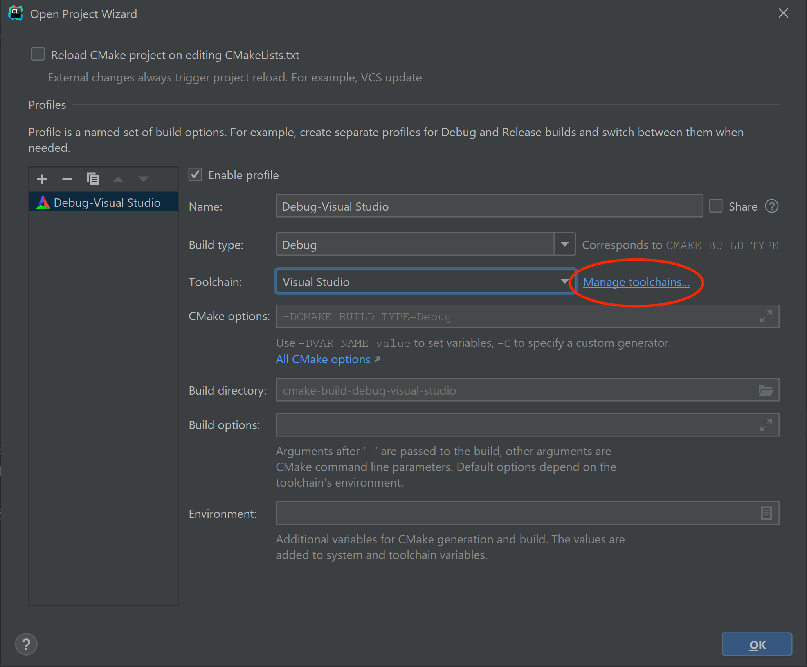
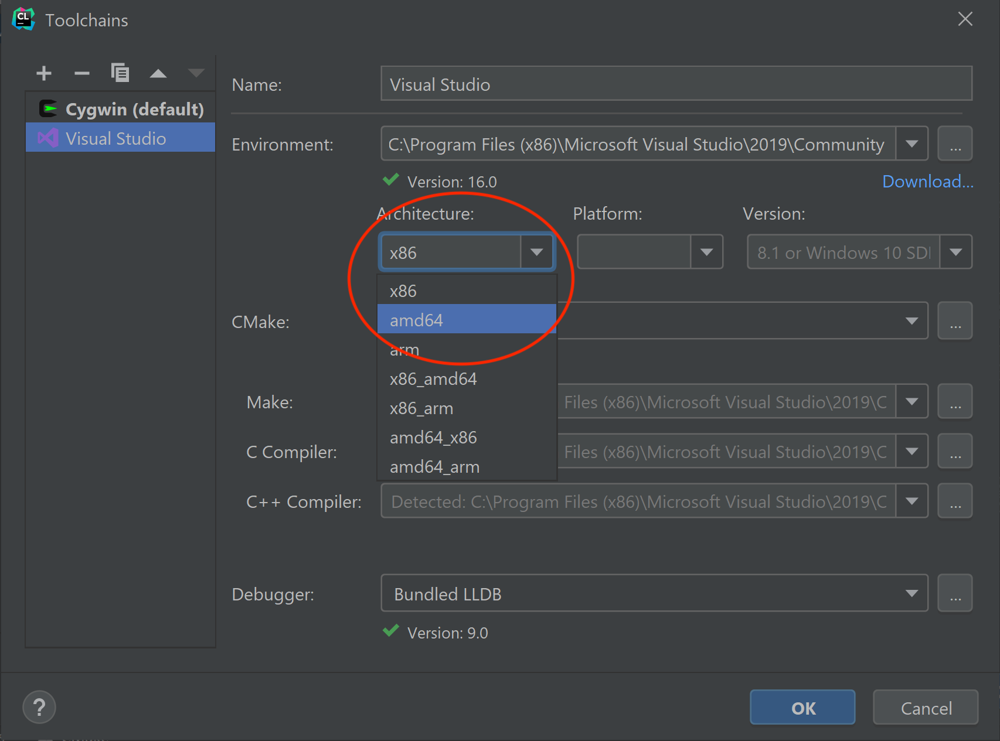

For this course, we will be using [CMake](https://cmake.org) to configure our build environment for proper compilation across different platforms. We will add each lab as a subdirectory into a single project to allow all of the labs to be visible in the same IDE window.

## Getting Started

Download [CS370\_Labs.zip](src/CS370_Labs.zip), saving it into the directory where you plan on placing all your labs.

Double-click on **CS370\_Labs.zip** and extract the contents of the archive into a subdirectory called **CS370\_Labs**

Open CLion, select **Open** from the main screen (you may need to close any open projects), and navigate to the **CS370\_Labs** directory. This should open the project and execute the CMake script to configure the toolchain.

## Windows

In the popup dialog, in the **Toolchain** drop down select Visual Studio

> 

Then select **Manage toolchains**

> 

In the toolchain dialog, be sure Visual Studio is selected, then in the **Architecture:** dropdown, choose **amd64**

> 

Then click **OK** to exit the dialog boxes. This will set Visual Studio x64 as the compiler for all the labs we'll be importing into this project folder for this course.

## Mac OSX

In the popup dialog, in the **Toolchain** drop down simply leave the default for Mac OSX which will use the XCode Clang compiler for all the labs we'll be importing into this project folder.

> 
